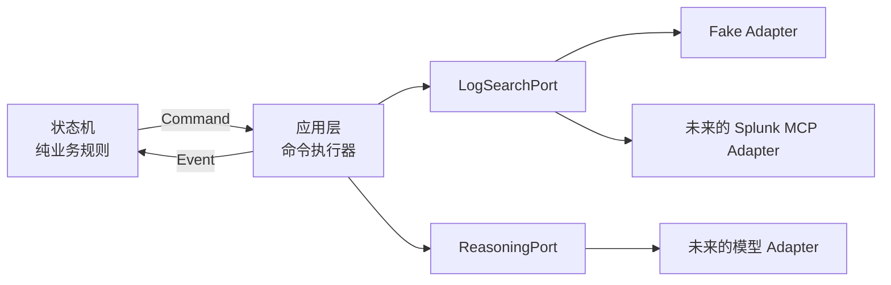

# 第二课：端口与适配器

## 这一课只解决一个问题

状态机发出 `ExecuteQuery` 命令以后，谁去调用 Splunk？

答案不是状态机自己，而是应用层。应用层依赖一个由我们定义的 `LogSearchPort`，真实的 Splunk MCP 代码以后作为 Adapter 接到这个端口上。

可以把它理解为插座和插头：

- **Port（端口）**：我们规定的插座形状，描述应用需要什么能力。
- **Adapter（适配器）**：把 Splunk MCP、LLM SDK 等外部接口转换成这个形状的插头。
- **状态机**：只决定下一步做什么，不知道电从哪里来。

## 为什么状态机不能直接调用 SDK

如果状态机直接导入 Splunk 或模型 SDK，它会同时承担四种职责：决定流程、发网络请求、理解外部返回格式、处理超时和错误。这样一个 SDK 字段变化就可能破坏诊断规则，纯状态测试也必须依赖网络。

现在的边界是：

1. 状态机输出 `Command`。
2. 应用层把命令转换成 Port 请求。
3. Adapter 调用外部能力，并把返回值转换成应用自己的数据类型。
4. 应用层再把结果转换成 `Event` 交还状态机。

因此，控制流程仍然是确定的；查询结果、假设和结论可以由外部能力动态产生。这正是“受约束的 ReAct”，而不是把整个 Agent 写死。

## 本课定义的两个端口

### `LogSearchPort`

只暴露一个异步操作：`search(SearchRequest) -> SearchResult`。

`SearchRequest` 目前包含：

- `operation_id`：用于关联状态机命令；命令执行器会把它映射回同一个 `command_id`，最终由状态机拒绝迟到的旧结果。
- `query_id`：本次查询的稳定标识。
- `authorized_query`：已经经过 ScopePolicy、QueryPlanCompiler 和 Policy Gate 的类型化计划。

未解析的 `scope_ref`、完整的自然语言 `QueryIntent` 对象和 raw SPL 已从 Port 请求中移除。Verify 的目标内容只可能以 Policy Gate 批准的 `literal_terms` 出现；Adapter 仍须把它作为数据转义，不能当语法拼接。详见第四课文档。

`AuthorizedQueryPlan` 只表示本进程中的 Gate 已通过本地策略，它不是调用者身份授权令牌，也不能替代真实 Adapter 的 Renderer 校验和 Splunk 只读 RBAC。

`SearchResult` 包含结果数、摘要、是否截断、证据和事实。它会验证：事实只能引用本次结果携带的证据，证据数量不能超过结果行数，标识不能重复。由于结果对象本身不持有请求，`evidence.query_id` 是否等于本次 `SearchRequest.query_id`，必须由下一课的命令执行器校验；不匹配属于 `PortProtocolError`，不能泄漏成领域错误。

### `ReasoningPort`

没有设计成宽泛的 `complete(prompt) -> text`，而是按业务阶段提供三个明确能力：

- 生成候选假设；
- 评估一次验证结果；
- 生成最终结论。

这样应用层拿到的是受约束的领域对象，而不是一段需要猜测含义的自由文本。

## 错误和取消的边界

Adapter 只向应用层提供已经清理过的 `PortError(code, safe_message)`，不能把凭据、原始请求或敏感日志塞进错误消息。这个类型不能自动判断内容是否敏感，脱敏责任仍在 Adapter；包装原始 SDK 异常时还应使用 `raise ... from None`，避免异常链向外泄漏。超时策略属于应用层；协程取消必须原样传播，不能被 Adapter 吞掉。这些行为会在命令执行器和 Fake 的异步测试中落实。

## 当前 Splunk MCP 侦察结果

当前仓库没有提供 Splunk MCP 的真实 Schema、服务端能力清单或可调用 Adapter，因此目前还不知道真实工具的：

- tool 名称和输入/输出 Schema；
- oneshot 或 job/poll 执行方式；
- 分页、截断、超时、取消和错误语义；
- 认证、RBAC、index 范围和只读保证。

所以本课不会伪造一个“真实适配器”。已经可以完成的是稳定的应用端口；有了真实 MCP 契约后，再实现对应 Adapter。

## 本课没有做什么

- 没有生成或执行 SPL；
- 没有调用 LLM；
- 没有实现命令执行器；
- 没有修改状态机。

命令执行器与 Fake 闭环已在第三课完成，安全查询管线见第四课。
