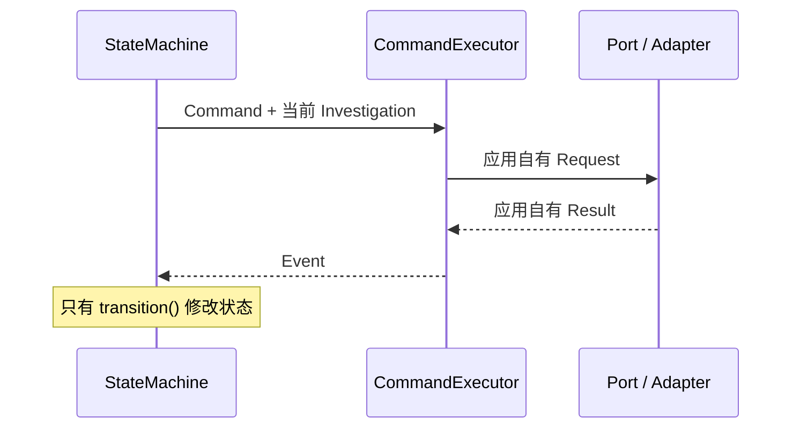

# 第三课：命令执行器与 Fake 闭环

## 这一课解决什么问题

前两课已经有两部分：

- 状态机知道“下一步做什么”；
- Port 描述“外部能力应该长什么样”。

它们之间还缺一座桥。`CommandExecutor` 就是这座桥：输入当前 `Investigation` 和一条 `Command`，调用正确的 Port，最后只返回一条 `Event`。



## 四条翻译规则

| Command | 调用的能力 | 返回的 Event |
|---|---|---|
| `ExecuteQuery` | `LogSearchPort.search` | `QuerySucceeded` |
| `GenerateHypotheses` | `ReasoningPort.generate_hypotheses` | `HypothesesGenerated` |
| `AssessVerification` | `ReasoningPort.assess_verification` | `VerificationAssessed` |
| `GenerateConclusion` | `ReasoningPort.generate_conclusion` | `ConclusionGenerated` |

Executor 不调用 `transition()`，也不直接修改 `Investigation`。Runner 才负责把 Executor 返回的 Event 交给状态机，并继续执行下一条 Command。

## 为什么查询 ID 由应用生成

领域查询 ID 使用：

```text
{command_id}:query
```

同一条 Command 即使重试，仍然得到同一个逻辑查询 ID；不同 Command 得到不同 ID。Splunk 的 sid/job id 属于 Adapter 内部细节，不能拿它代替领域 ID。

这只是稳定的关联 ID，不代表查询已经幂等：重复调用 Executor 目前仍会调用 Port 两次。真实接入时还需要用 operation id、命令日志或结果缓存去重，避免重复消耗 Splunk 和查询预算。

`QueryRecord` 也由 Executor 使用原始 `command.intent` 构造，不能相信 Adapter 回显的意图。这样 Adapter 无法偷偷改变查询种类、时间范围或假设目标。

## 外部调用前后的两道门

调用前，Executor 确认：

- Command 属于当前 pending operation；
- `command_id` 和操作类型一致；
- 查询意图、假设 ID、查询 ID、结论参数没有被改写；
- 迟到或伪造的 Command 在产生外部副作用前就被拒绝。

调用后，Executor 确认：

- 每条搜索证据都属于本次 `query_id`；
- 外部结果没有复用已有 evidence/fact ID；
- 推理结果没有换掉假设或借用其他查询的证据；
- 后续查询没有扩大时间范围；
- 结论没有改变 outcome、终止原因或根因 ID。

状态机仍会再次执行领域不变量校验。Executor 是外部协议边界，状态机是最终业务边界。

## 失败、超时和取消不是一回事

| 情况 | 行为 |
|---|---|
| Adapter 抛出 `PortError` | 转成相同 `command_id` 的 `OperationFailed` |
| 外部返回违反协议 | 固定安全消息的 protocol failure |
| 单次调用超时 | 取消底层协程，调查进入 `FAILED` |
| Python task 被取消 | 原样传播 `CancelledError` |
| 未知 `RuntimeError` | 原样暴露给开发测试和监控，不伪装成诊断失败 |
| 用户主动取消调查 | 由上层发送 `CancelRequested`，进入 `CANCELLED` |

超时表示工具没有完成工作，所以是 `FAILED`，不是“没有查到根因”的 `INCONCLUSIVE`。Task cancellation 也不能偷偷转换成 `FAILED`；调用方还需要负责记录或发送用户取消事件。

当前 Runner 是内部编排组件，不是 API/CLI 的用户安全边界。未来入口层必须拦截未知异常、记录受控诊断信息，并向用户返回固定的脱敏错误；不能直接显示异常原文。

## Fake Adapter 做了什么

`FakeLogSearchPort` 根据授权计划的 `template_id` 返回内存中的确定性日志行，并使用收到的 `query_id` 动态生成 Evidence 和 Fact。

`DeterministicReasoningPort` 固定提出一个假设；验证查询有证据时，将假设标记为 `SUPPORTED`，再生成只引用这些验证证据的结论。

Fake 不是在证明 Splunk 或 LLM 可用。它也不能证明某段日志在语义上真的支持某个假设：当前确定性 Reasoner 只检查验证查询是否带有 Evidence。它证明的是证据引用结构和编排链路已经连通，而且无需网络就能重复测试：

```text
NEW
→ TRIAGE 查询
→ 生成假设
→ VERIFY 查询
→ 评估验证
→ 生成结论
→ COMPLETED
```

## 当前边界

- `QueryIntent.goal` 仍是语义目标，不是 SPL；
- scope/index 白名单和 Policy Gate 已在第四课补齐；
- 第六课已补上 provider-neutral 模型结构化输出、严格校验与有限重试；
- 还没有真实 Splunk MCP Adapter；
- Runner 当前只负责从全新的 Investigation 顺序运行到终态。

安全查询管线见第四课，结构化推理边界见第六课文档。
