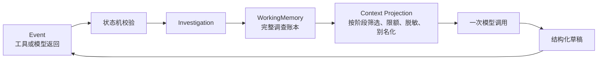

# 第五课：上下文与记忆的设计

> 本章补回此前遗漏的教学层。当前仓库已经实现进程内 `WorkingMemory`、引用完整性校验和有界模型上下文；尚未实现持久化存储、跨进程恢复、长期记忆或生产数据保留策略。

前四课已经让调查流程可以安全地发出命令并接收结果。下一步不是立刻加更多 Prompt，而是先回答一个容易被混淆的问题：**Agent 到底记住什么，谁可以修改它，模型每轮又能看到什么？**

如果这个边界不清楚，常见结果是把全部聊天记录、查询结果和原始日志不断追加到 Prompt。这样做会同时产生四类问题：

- 上下文随轮次无限增长，成本和延迟不可控；
- 旧结论、用户输入和工具输出混在一起，模型无法区分事实与猜测；
- 原始日志和内部标识被重复外发，扩大数据泄漏面；
- 进程重启后无法准确恢复，因为“状态”只存在于一段对话文本中。

本章把这些概念分开，并以当前实现为事实源。

## 1. 先区分四个概念

| 概念 | 在本项目中的含义 | 当前实现 |
|---|---|---|
| 调查状态 `Investigation` | 阶段、预算、待执行操作、终止结果和版本 | 已实现 |
| 工作记忆 `WorkingMemory` | 本次调查中已经确认或正在验证的结构化记录 | 已实现，当前仅在进程内 |
| 模型上下文 | 某一次模型调用所需的、从状态和记忆投影出的最小视图 | 已实现有界投影 |
| 长期记忆 | 跨调查复用的经验、偏好或历史案例 | 未实现；当前领域知识配置不等于长期记忆 |

## 代码导读

| 阅读目标 | 源码 | 对应测试 |
|---|---|---|
| `WorkingMemory` 与 `Investigation` 的引用不变量 | [`domain/models.py`](../src/log_agent/domain/models.py) | [`test_domain.py`](../tests/unit/test_domain.py) |
| Event 如何合并查询、事实、证据和假设 | [`domain/state_machine.py`](../src/log_agent/domain/state_machine.py) | [`test_domain.py`](../tests/unit/test_domain.py) |
| 完整记忆如何变成一次有界模型上下文 | [`adapters/structured_reasoning.py`](../src/log_agent/adapters/structured_reasoning.py) | [`test_structured_reasoning.py`](../tests/unit/adapters/test_structured_reasoning.py) |
| 知识参考数据的独立投影 | [`application/knowledge_projection.py`](../src/log_agent/application/knowledge_projection.py) | [`test_knowledge_projection.py`](../tests/unit/application/test_knowledge_projection.py) |

阅读顺序是 `WorkingMemory` → `Investigation._validate_memory_references()` → 状态机的 `_merge_query_result()` / `_merge_hypotheses()` / `_replace_hypothesis()` → `StructuredReasoningAdapter._require_memory_context()` 和三个 `_prepare_*_context()`。

这条路径展示了两次不同的校验：领域模型确保完整账本内部一致；模型 Adapter 再根据阶段、预算和可见证据构造最小上下文。后者失败时必须发生在模型 I/O 之前。当前没有 Repository 或序列化模块，因此在源码树里找不到持久化实现是预期状态，不是遗漏。

最重要的关系是：



模型上下文是工作记忆的**临时只读视图**，不是工作记忆本身。模型也不能直接改写 `WorkingMemory`；它只能返回受限草稿，应用把草稿转换成事件，状态机验证后才产生新状态。

## 2. `WorkingMemory` 保存什么

当前定义位于 `src/log_agent/domain/models.py`：

```python
@dataclass(frozen=True, slots=True)
class WorkingMemory:
    facts: tuple[Fact, ...] = ()
    hypotheses: tuple[Hypothesis, ...] = ()
    evidence: tuple[EvidenceRef, ...] = ()
    queries: tuple[QueryRecord, ...] = ()
```

四个集合承担不同责任：

- `facts`：已经由查询结果支持的结构化观察。每个 Fact 必须引用至少一个 EvidenceRef。
- `hypotheses`：待验证、验证中、已支持或已排除的解释。所谓“已排除项”不是另一份随手记，而是 `status == REFUTED` 的假设，可通过 `refuted_hypotheses` 派生。
- `evidence`：证据引用和必要元数据，不保存整段原始日志。`record_ref` 能否在未来稳定取回原文，必须由真实 MCP 契约证明。
- `queries`：执行过的语义查询记录、结果数量、摘要、截断标志以及它暴露的证据 ID。

它故意不保存：

- 模型的私有思维链；
- 未经校验的模型 JSON；
- 完整聊天历史；
- 原始 Splunk 返回体；
- API token、物理权限或可执行 SPL；
- 跨调查自动学习出的“经验”。

这些内容要么不应保存，要么属于 Adapter、审计存储或未来经过治理的知识系统，不能偷偷塞进调查记忆。

## 3. 记忆为什么必须是结构化账本

自然语言摘要可以帮助人阅读，但不能单独承担系统状态。程序需要能验证以下关系：

```text
QueryRecord.id
    └── EvidenceRef.query_id
            └── Fact.evidence_ids
            └── Hypothesis.supporting_evidence_ids
            └── Hypothesis.contradicting_evidence_ids
```

`Investigation._validate_memory_references()` 当前会检查：

- Fact、Hypothesis、EvidenceRef 和 QueryRecord 的 ID 在各自集合内唯一；
- 每条 EvidenceRef 都指向已知 QueryRecord；
- Fact 和 Hypothesis 只能引用账本中存在的证据；
- QueryRecord 声明的证据集合必须与实际保存的 EvidenceRef 一致。

因此一句“payment-service 超时了”只有在它对应到真实 Fact 和 EvidenceRef 时，才可能继续成为可引用结论。结构化记忆不是为了让对象显得复杂，而是为了让“模型说过”和“系统已经证明”成为两个不同的事实。

## 4. 谁可以更新记忆

当前领域对象使用 `frozen=True` 和 tuple。每次更新都创建新的 `Investigation` / `WorkingMemory` 值，而不是在原对象上随意追加：

```text
旧状态 + 已校验 Event
        ↓ transition(...)
新状态 + 下一条 Command
```

状态机中的更新规则包括：

- `QuerySucceeded` 通过 `_merge_query_result()` 同时登记 query、evidence 和 facts；
- `HypothesesGenerated` 通过 `_merge_hypotheses()` 添加新的候选假设；
- `VerificationAssessed` 只能替换目标假设的状态和证据引用，不能改写原假设内容；
- 新证据不能与旧 ID 冲突，也不能引用其他查询没有暴露的记录；
- 已引用证据不能在后续判断中被悄悄丢弃。

这里的核心原则是：**事件提出变化，状态机批准变化。** Adapter 和 LLM 都不拥有记忆写权限。

`frozen=True` 只保证 Python 对象不会被原地修改，不代表数据已经持久化，也不自动解决并发写入。真正的恢复能力仍需要存储层提供版本检查和原子写入。

## 5. 工作记忆不等于模型上下文

即使 `WorkingMemory` 是可信的，也不能把它完整序列化后发给模型。原因包括：

- 当前阶段只需要其中一部分信息；
- 内部 ID、`record_ref` 和不相关事实不应外发；
- 记忆规模可能超过上下文预算；
- 动态文本仍可能包含敏感数据或提示注入内容。

当前 `StructuredReasoningAdapter` 在调用模型前建立阶段化上下文，并通过 `ReasoningContextBudget` 限制：

- 最多扫描多少条 memory item；
- 最多选择多少 Fact、Query、Hypothesis 和 Evidence；
- 单段动态文本与完整序列化输入的字符数；
- 输出 token 和字节数。

证据 ID 会临时映射为 `e1`、`e2` 等别名。模型只能引用本次视图中可见的别名，Adapter 再把别名映射回领域证据 ID。未进入上下文的 EvidenceRef 即使存在于完整记忆中，也不能被模型引用。

这里要把两个阶段分清：

```text
WorkingMemory
  → 选择本阶段需要的内容
  → 应用数量和字符预算
  → Sanitizer 检查动态文本
  → 隐藏内部标识并生成证据别名
  → Model Context
```

第七课会继续实现和解释 `KnowledgeProjection` 与结构化模型边界；本章负责先建立记忆和上下文不是同一个对象的设计原则。

## 6. 领域知识也不是工作记忆

下一课的 `KnowledgeSnapshot` 描述相对稳定、由系统负责人维护的参考资料，例如组件关系、错误码和已知故障模式。它与 `WorkingMemory` 的区别如下：

| 对比项 | WorkingMemory | KnowledgeSnapshot |
|---|---|---|
| 生命周期 | 一次调查 | 跨调查版本化配置 |
| 来源 | 本次状态机接纳的事件 | 受信 JSON 配置 |
| 内容 | 查询、事实、假设、证据引用 | 组件、错误码、依赖、已知模式 |
| 能否作为证据 | 其中的真实 EvidenceRef 可以 | 不能，只是待验证参考 |
| 能否授予权限 | 不能 | 不能，权限只来自 ScopePolicy |

未来即使加入历史 incident 检索，也必须明确它返回的是“参考候选”还是“本次证据”，不能因为名字叫 memory 就绕过证据规则。

## 7. 重启、恢复与长期运行还缺什么

当前实现可以在一次进程内调查中可靠传递记忆，但还不能宣称支持生产级恢复。至少还缺：

1. `InvestigationRepository` 之类的存储端口，以及明确的序列化 Schema 版本；
2. 以 `Investigation.revision` 做乐观并发控制，拒绝覆盖较新的状态；
3. 状态和待执行命令的原子提交，或可证明安全的 outbox/inbox 协议；
4. `command_id` 幂等记录，避免重启后重复执行外部查询；
5. 对敏感摘要、EvidenceRef 和 trace 的加密、访问控制、保留期与删除策略；
6. 恢复测试：在每个 phase 和每类 pending operation 前后模拟崩溃。

这些属于第十课“运行时装配与安全入口”的实现范围。长期记忆则是更晚的独立能力，必须先定义写入审批、污染防护、租户隔离、过期和删除机制；本课程当前不假装已经实现。

## 8. 本章如何验证

阅读和运行以下测试：

```bash
pytest tests/unit/test_domain.py
pytest tests/unit/adapters/test_structured_reasoning.py
```

重点观察三类失败：

- 构造 Fact 引用不存在的 evidence，`Investigation` 应立即拒绝；
- 让模型引用未投影的 evidence alias，Adapter 应拒绝输出；
- 让 memory 超过扫描或序列化预算，模型 I/O 发生前就应失败。

可以再做一个练习：向 `WorkingMemory` 加入第二条与当前阶段无关的 Fact，确认它仍在完整状态中，但在收紧 `ReasoningContextBudget(max_facts=1)` 后不会进入模型输入。这个实验能直观看到“记住”和“本轮展示”是两件事。

## 9. 本章完成标准

- 能解释 `Investigation`、`WorkingMemory`、模型上下文和长期记忆的区别；
- 能指出四类 WorkingMemory 数据之间的引用关系；
- 能证明只有状态机可以接纳记忆更新；
- 能证明模型只能引用本轮可见证据；
- 不把 immutable 对象误称为持久化或恢复能力；
- 不把 KnowledgeSnapshot、聊天历史或原始日志冒充工作记忆。

下一课阅读[领域知识配置](06-领域知识配置.md)：为推理提供版本化参考资料，同时继续保持知识、证据和权限三个信任域彼此分离。
