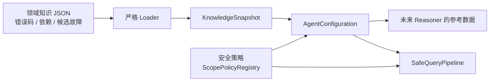

# 第六课：领域知识配置

这一课让 Agent 拥有可版本化的系统知识，但不让这些知识获得查询权限。

## 代码导读

| 阅读目标 | 源码/配置 | 对应测试 |
|---|---|---|
| 领域知识实体与 `KnowledgeSnapshot` 不变量 | [`domain/knowledge.py`](../src/log_agent/domain/knowledge.py) | [`test_knowledge_json.py`](../tests/unit/adapters/test_knowledge_json.py) |
| 严格 JSON 文件加载与路径化错误 | [`adapters/knowledge_json.py`](../src/log_agent/adapters/knowledge_json.py) | [`test_knowledge_json.py`](../tests/unit/adapters/test_knowledge_json.py) |
| 知识快照与安全/可见性策略的兼容性装配 | [`application/configuration.py`](../src/log_agent/application/configuration.py) | [`test_configuration.py`](../tests/unit/application/test_configuration.py) |
| 可运行示例知识包 | [`config/knowledge/checkout-domain.json`](../config/knowledge/checkout-domain.json) | Loader 测试与投影测试 |

建议先从示例 JSON 看数据形状，再读 `load_knowledge_json()` 的文件、字节、UTF-8 和 JSON 解析边界；然后读 `_KnowledgeDecoder` 如何逐字段转换；最后读 `KnowledgeSnapshot.__post_init__()` 如何校验跨实体引用并排序成确定性快照。

```text
JSON bytes
  → 文件/大小/编码检查
  → 拒绝重复 key、浮点数、未知字段和过深结构
  → _KnowledgeDecoder
  → KnowledgeSnapshot 交叉引用校验
  → AgentConfiguration 对齐 scope
```

`content_hash` 对规范化 JSON 内容求 SHA-256，用于版本识别和复现，不是数字签名。`AgentConfiguration` 只检查独立配置是否精确对齐，不会把 KnowledgeSnapshot 中的内容转换成查询权限。

## 先看最容易犯的错误

把下面内容全部放进一份由领域专家维护的文件：

- 错误码和系统依赖；
- index、sourcetype；
- 允许使用的查询模板；
- 最大时间范围和返回数量。

这样虽然省事，却把“解释系统的人”同时变成了“授予数据访问权限的人”。一次普通知识更新就可能意外扩大查询范围。

因此我们建立两个独立信任域：



关键点是：查询管线的权限只来自 `ScopePolicyRegistry`，不来自 `KnowledgeSnapshot`。

## 两类配置分别负责什么

领域知识由系统负责人维护，用来帮助推理：

- 组件名称、类型和职责；
- 语义字段 ID 及含义；
- 错误码含义；
- 调用依赖；
- 已知故障的候选原因与所需证据。

安全策略由安全或运维负责人维护，用来控制执行：

- 精确的 index + sourcetype 组合；
- 允许的模板和操作；
- 最大时间跨度和返回数量；
- 未来的物理字段映射、字段能力和敏感等级。

领域知识 Schema 故意不接受 `index`、`sourcetype`、`raw_spl`、`allowed_operations`、`renderer` 或 MCP 工具名。

## 为什么先用 JSON

项目仍保持运行时零第三方依赖。标准库可以解析 JSON，而且 JSON 没有 YAML 自定义标签、对象构造和 alias 等额外执行面。这里的“Schema”指由严格 Loader 与 dataclass 执行的 JSON 文档契约，当前没有额外发布一份 JSON Schema 标准文件。

当前 Loader 按以下顺序工作：

```text
普通文件的受限字节流
→ 最多读取 max_bytes + 1 字节
→ UTF-8 解码
→ JSON 解析（拒绝重复 key 和非有限数字）
→ 嵌套深度限制
→ 严格字段与类型检查
→ ID 去重和交叉引用校验
→ 不可变 KnowledgeSnapshot
→ 规范化内容哈希
```

任何一步失败都会拒绝整份配置，不进行部分加载、自动纠错、trim 或 fallback。

## Snapshot 中有什么

仓库示例文件位于 `config/knowledge/checkout-domain.json`，主要结构如下。它是外部部署配置示例，不作为 wheel 内置的默认生产知识：

```json
{
  "schema_version": 1,
  "bundle_id": "checkout-domain",
  "revision": "2026-08-02.1",
  "system_id": "checkout",
  "scope_refs": ["checkout-prod"],
  "components": [],
  "fields": [],
  "error_codes": [],
  "dependencies": [],
  "known_failures": []
}
```

`revision` 是人可读版本；`content_hash` 由 Loader 计算，用来准确标识本次加载的内容。JSON 对象 key 的排列变化不会改变哈希。这个哈希不是签名，也不代表文件已经审批或来源可信；生产环境仍需受控发布路径、文件权限、审计与回滚流程。

所有对象最终都成为 frozen dataclass，JSON 数组变成 tuple；顶层实体按稳定 ID 排序，候选原因与证据要求保留作者顺序。这样同一次调查可以固定使用同一份快照，避免运行过程中知识含义发生变化。

## 交叉引用为什么重要

下面这些配置都必须在启动时失败：

- Field 引用了不存在的 component；
- ErrorCode 引用了不存在的 component；
- Dependency 的任一端不存在或指向自身；
- KnownFailure 引用了不存在的错误码或组件；
- component、field、error code 或 pattern ID 重复。

错误码使用稳定 `id` 作为引用，实际 `code` 按 `(component_id, code)` 判重。这样两个组件都使用 `TIMEOUT` 时不会产生全系统歧义。

如果不在加载时失败，错误只能等到 Agent 推理中途才暴露，届时很难区分是日志证据不足，还是配置本身损坏。

## KnownFailure 不是自动规则

已知故障只包含：

- 候选原因；
- 确认它所需的证据；
- 相关组件和错误码。

它没有正则、SPL、脚本或工具调用等可执行字段，也不能直接把 Hypothesis 标记成 `SUPPORTED`。但它的 title、候选原因、证据要求和描述仍然是未可信自由文本，完全可能出现类似 SPL 或 Prompt Injection 的内容；应用不会执行这些文字。未来进入模型前必须投影、裁剪、分类并明确标成参考数据，模型产生的任何查询意图仍须经过 QueryLiteral 和 Policy Gate。模型可以参考它提出假设，但仍然必须查询并取得 EvidenceRef，才能形成结论。

## 与现有程序如何连接

`AgentConfiguration` 启动时要求知识文件中的 `scope_refs` 与安全策略中的 scope 精确一致：

```text
KnowledgeSnapshot.scope_refs == ScopePolicyRegistry.refs
```

不一致就 fail closed。这只证明 scope 名称集合一致，不证明同名 policy 指向了正确的物理日志源；真实部署仍需把 system、knowledge revision/hash 与 policy version 放入受审发布清单。检查成功后，`build_query_pipeline()` 仍然只把安全策略交给 `SafeQueryPipeline`；知识对象不会参与授权计算。

当前 Fake 端到端测试已经通过真实 JSON Loader 和这个绑定步骤，但 `DeterministicReasoningPort` 仍保持固定行为。它不会假装已经理解领域知识。

## 本课完成与未完成的边界

已经完成：

- 严格 JSON Loader；
- 不可变、带版本与内容哈希的知识快照；
- 组件、字段语义、错误码、依赖、已知故障 Schema；
- 重复项、未知字段、资源上限和交叉引用校验；
- 与 ScopePolicy 的精确 scope 名称集合检查；
- Fake 端到端启动路径接入。

尚未完成：

- 生产系统真实知识内容；
- 生产级知识外发分类、审批与发布流程；
- 物理字段名、group/filter/project 权限和 PII 分类；
- 安全策略文件 Loader、审批和热更新；
- 新的字段型 QueryPlan、Renderer、真实模型与真实 MCP。

未来安全侧必须显式维护 `semantic_field_id → physical field` 映射。映射缺失时必须拒绝，Renderer 禁止把语义 ID 原样当成 Splunk 字段名 fallback。

第七课已经实现有实体数、字符数和相关性上限的 `KnowledgeProjection`，并接入 provider-neutral 的结构化 Reasoner 边界。只有本次调查相关且策略允许外发的知识会进入“参考数据区”；完整 Snapshot、未校验 JSON 原文和安全策略不会拼进 System Prompt。实现细节见 [`07-知识投影与结构化推理.md`](07-知识投影与结构化推理.md)。生产接外部模型前，仍必须完成知识来源审批、允许外发分类和真实日志脱敏。
