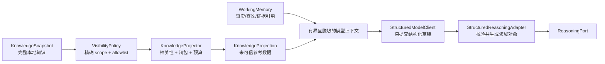

# 第七课：知识投影与结构化推理

这一课让模型开始参与真正的诊断推理，但不把工作流、权限和证据账本交给模型。

## 代码导读

| 阅读目标 | 源码 | 对应测试 |
|---|---|---|
| 阶段、可见性策略、预算、相关性选择和投影哈希 | [`application/knowledge_projection.py`](../src/log_agent/application/knowledge_projection.py) | [`test_knowledge_projection.py`](../tests/unit/application/test_knowledge_projection.py) |
| provider-neutral 模型请求、响应和 Sanitizer 端口 | [`application/model_ports.py`](../src/log_agent/application/model_ports.py) | [`test_model_ports.py`](../tests/unit/application/test_model_ports.py) |
| 阶段上下文、Evidence alias、严格 JSON 解析与有限修复 | [`adapters/structured_reasoning.py`](../src/log_agent/adapters/structured_reasoning.py) | [`test_structured_reasoning.py`](../tests/unit/adapters/test_structured_reasoning.py) |
| 真实 Runner 中的结构化推理闭环 | 上述文件与 Executor | [`test_structured_reasoning_investigation.py`](../tests/integration/test_structured_reasoning_investigation.py) |

建议分两条线阅读。第一条从 `KnowledgeProjector.project()` 开始，看精确 scope、显式 allowlist、阶段过滤、引用闭包、实体预算和最终序列化预算如何产生 `KnowledgeProjection`。第二条从 `StructuredReasoningAdapter.generate_hypotheses()` 开始，再依次读 `assess_verification()`、`generate_conclusion()` 和各自的 `_prepare_*_context()`。

核心调用链是：

```text
WorkingMemory + InvestigationRequest
  → TaskSignals
  → KnowledgeProjector.project()
  → 阶段化 observations + domain_reference
  → ReasoningTextSanitizer
  → StructuredModelRequest
  → StructuredModelClient.generate()
  → 严格解析 + alias 解析 + 领域对象构造
```

`StructuredReasoningAdapter` 不允许模型决定 phase、预算、终止原因、真实 Evidence ID 或查询范围。第一次输出结构错误时最多发起一次修复请求；第二次仍错误就返回稳定的 `PortProtocolError`。测试中的 `RecordingModelClient` / Sanitizer 是边界替身，不是生产 Provider 或生产脱敏器。

## 先看失败方案

最直接的接法通常是：

```text
System Prompt
+ 完整领域知识 JSON
+ 完整 WorkingMemory
+ 原始日志和 record_ref
+ “请分析并决定下一步”
```

这个方案同时产生五个问题：

- 完整知识可能包含与本次任务无关、未获准外发的内容；
- scope、安全策略和物理日志位置可能被一起泄露；
- Prompt 长度会随知识和历史不断增长；
- 模型可以伪造 Evidence ID、状态、查询时间范围或终止原因；
- 一段配置描述、用户问题或日志文字可能被误当成指令。

所以本课没有把 `KnowledgeSnapshot` 直接交给模型，也没有让模型返回完整领域对象。我们增加了两层边界：



## 第一层：KnowledgeProjection

`KnowledgeSnapshot` 是本地完整快照；`KnowledgeProjection` 是某一个 scope、某一个推理阶段、某一次任务信号下允许送往模型的最小参考数据。

投影严格按这个顺序执行：

```text
精确匹配 scope
→ 校验 policy 固定的 bundle_id + content_hash
→ 先执行可见性 allowlist
→ 只在已可见集合内做本地相关性排序
→ 补齐实体引用闭包
→ 执行分类数量、总实体数、最终 JSON 字符数预算
→ 生成稳定 JSON 与 projection_hash
```

“先可见性、后相关性”很重要。若先在完整知识中搜索，再过滤结果，排序、数量或截断标记本身都可能泄露隐藏实体是否存在。

### 精确 scope，没有 fallback

`ProjectionVisibilityPolicy` 精确绑定：

- `scope_ref`；
- `knowledge_bundle_id`；
- `knowledge_content_hash`；
- 每类知识的显式 allowlist；
- 每类数量、总实体数和最终序列化字符预算。

未知 scope、旧知识哈希、错误 bundle 或缺少策略都会 fail closed。`AgentConfiguration` 还要求以下三组 scope 在启动时完全一致：

```text
KnowledgeSnapshot.scope_refs
== ScopePolicyRegistry.refs
== tuple(sorted(policy.scope_ref for policy in visibility_policies))
```

查询权限仍然只来自 `ScopePolicyRegistry`。投影策略只能决定“哪些参考知识可向模型展示”，不能授权查询。

### 引用闭包不能破坏

投影按完整实体加入或丢弃，不截断单个描述，并维护这些关系：

- Field 或 ErrorCode 只有在所属 Component 也可见时才能进入；
- Dependency 只有在调用方和被调用方都可见时才能进入；
- KnownFailure 只有在它引用的所有 Component 和 ErrorCode 都可见时才能进入。

如果预算容不下整个闭包，就丢弃这一候选项，而不是留下悬空引用。

### 不同阶段看到不同知识

| 推理阶段 | 可投影类别 |
|---|---|
| 生成假设 | Component、ErrorCode、Dependency、KnownFailure |
| 评估验证 | Component、Field、ErrorCode、Dependency、KnownFailure |
| 生成结论 | Component、Field、ErrorCode、Dependency |

KnownFailure 只是一份“未验证候选参考”，不能成为证据。生成最终结论时再次移除它，避免模型把历史模式写成已经证明的根因。Field 除了阶段限制，还必须被策略显式允许；默认空 allowlist 就是不可见。

`model_json` 不含 scope、policy、bundle provenance、index、sourcetype、物理字段名或执行权限。bundle/revision/hash、policy/hash 和 projection/hash 只保存在本地 trace context，具体 provider adapter 禁止把这些 trace 字段序列化给外部模型。

## 第二层：模型只能提交草稿

原有 `ReasoningPort` 没有改变。`StructuredReasoningAdapter` 在它的内部依赖一个更低层的 `StructuredModelClient`：

```text
ReasoningPort                         StructuredModelClient
-------------------------------       ------------------------------
返回 Hypothesis / Assessment /        接收静态指令、JSON 数据、JSON Schema
Conclusion 领域对象                   返回一个 JSON 字符串草稿
```

模型与应用的权力边界如下：

| 阶段 | 模型可以草拟 | 程序强制拥有 |
|---|---|---|
| 假设 | statement、verification_goal | hypothesis ID、初始 `PROPOSED` 状态、空证据集合 |
| 验证 | verdict、新证据别名、可选 next goal | Hypothesis 状态、VerificationDecision、QueryKind、时间范围、hypothesis_id |
| 结论 | summary、证据别名、给人工的建议 | outcome、termination_reason、root_cause_hypothesis_id |

因此模型不能通过输出 `status=supported`、扩大时间窗口或自己声明 `ROOT_CAUSE_IDENTIFIED` 来越过状态机。额外字段会被严格 Schema 拒绝。

模型生成的 `verification_goal` 和后续 goal 仍须通过 `QueryLiteral`。之后 Executor 创建的 `QueryIntent` 还会进入第四课的 Compiler + Policy Gate；模型始终不接触 SPL、index、sourcetype 或工具调用。

## 为什么证据使用别名

真实 Evidence ID 和 `record_ref` 都留在应用进程。每次模型调用只创建临时别名：

```text
本地映射：e1 → run-123:query:evidence:1
模型看到：e1
```

模型返回 `e1` 后，Adapter 只允许从本次调用的 allowlist 反查真实 ID。`e999`、其他查询的别名或重复/冲突分类都会失败。

验证阶段还有一条更严格的规则：只有实际随可见 `Fact` 进入本次有界上下文的证据才能获得“可新增引用”别名。查询可能返回 50 个 EvidenceRef，但上下文只展示 30 条 Fact；未展示内容的证据不会获得可引用别名。模型不能引用一条自己根本没看见的日志。

要把本次验证判定为 `SUPPORTED` 或 `REFUTED`，必须至少引用一条本次查询的新证据。旧证据会保留，但不能冒充本次查询结果；零结果或后端标记为 `truncated` 的验证也不能产生终局判定。

结论阶段只开放与可见查询/事实相关的别名；conclusive 结论又进一步限制为受支持根因假设的 supporting evidence。

## Prompt 与数据如何分开

`StructuredModelRequest` 把内容分成四部分：

- `instructions`：版本化、静态、受信的阶段规则；
- `input_json`：用户问题、观察和投影知识，全部标成未可信数据；
- `response_schema_json`：本阶段允许返回的精确字段；
- `trace_context`：仅供本地审计，禁止发送给模型。

用户问题、Fact、Query summary、Hypothesis 和 verification goal 必须先经过显式 `ReasoningTextSanitizer`。本课测试使用的是测试替身，不是生产脱敏器。没有生产字段分类、PII/凭据规则和 Redactor 之前，仍然禁止把真实生产日志发送给外部 LLM。

JSON 数据隔离和静态指令能减少指令混淆，但不能单独“证明没有 Prompt Injection”。真正的安全边界还包括来源审批、可见性策略、脱敏、最小数据、结构化输出校验，以及模型结果不能直接执行。

## 输出校验与有限重试

本地解析器拒绝：

- 非 JSON、重复 key、浮点数和非有限数；
- 未知或缺失字段、错误 schema version；
- 超长文本、超多数组项、过深嵌套、超大输出；
- 不安全的 QueryLiteral；
- 重复假设、伪造证据别名、支持/反驳证据重叠；
- 与当前 outcome、查询完整性或领域状态不一致的草稿。

格式、Schema 或 literal 校验失败最多修复一次，第二次仍失败就返回固定的 `reasoning.invalid_output`。重试请求不会附带第一次的原始非法输出，避免把攻击内容再次拼入指令。refusal、截断输出、工具调用型 finish reason、证据越权和领域策略违规不靠放宽规则重试。

请求还携带 provider 必须执行的 `max_output_tokens` 和流式 `max_output_bytes`。本地解析器再次检查字节上限，形成两道资源边界。

预期的 provider 故障必须转换为已清洗的 `PortError` / `PortUnavailable`；脱敏策略拒绝使用 `ReasoningTextSanitizationError`。协程取消原样传播，未知程序错误也原样暴露给测试和监控，不能被一把捕获后伪装成普通诊断失败。

## 本课测试证明了什么

测试覆盖：

- visibility-first、精确 scope、无 fallback 和稳定 projection hash；
- 实体引用闭包、阶段隔离、实体数和最终 JSON 字符预算；
- 隐藏 canary 不影响投影结果，恶意自由文本仍只是 JSON 字符串；
- 模型不能生成 ID、状态、时间范围、真实 Evidence ID 或结论 outcome；
- 只有可见 Fact 对应的临时别名能成为新证据；
- 空结果、截断结果、伪造别名和跨查询证据不能产生根因；
- 严格 JSON、一次修复、拒绝、未完成输出、上下文预算和取消语义；
- Fake model + Fake log + Executor + 状态机 + Runner 的完整闭环。

完整集成测试现在会执行三次模型草稿调用：生成假设、评估验证、生成结论，并最终由状态机得到带真实结构化证据链接的 `COMPLETED`。

## 已完成与尚未完成

已经完成：

- 有界、可审计、分阶段的 `KnowledgeProjection`；
- 独立的知识可见性策略与启动期 scope 对齐；
- provider-neutral `StructuredModelClient` 契约；
- 实现 `ReasoningPort` 的结构化推理 Adapter；
- 证据别名、严格解析、有限重试和本地资源上限；
- Fake structured model 单元与完整集成回归。

尚未完成：

- 任何真实 LLM provider SDK/Adapter；
- 生产级日志 Sanitizer/Redactor、PII 分类和允许外发策略；
- visibility policy 的受控配置 Loader、审批、签名和发布流程；
- prompt/model 评估集、质量门槛、成本与延迟指标；
- 真实 Splunk MCP Adapter 和最终 SPL Renderer/RBAC 验收。

所以准确说法是：**结构化模型边界已经可编程、可测试，但尚未把真实生产数据连接到外部模型。** 下一课[真实适配器与脱敏边界](08-真实适配器与脱敏边界.md)将定义 Splunk MCP、真实模型、Renderer 与 Redactor 的接入闸门；不能只安装一个 SDK 就宣布完成。
