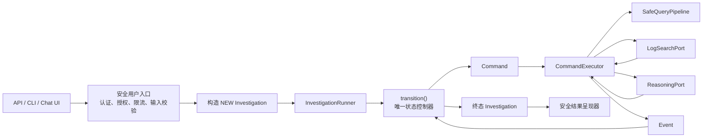

# 第 10 章：Agent Loop 装配与安全用户入口

> 本章不是再写一个 Agent Loop。第三课已经实现了 `InvestigationRunner`，状态机、命令执行器和端口之间的闭环也已有测试覆盖。本章解决的是：如何在应用启动时把这些组件装配起来，以及如何在它们前面建立真正的用户安全边界。

## 本章定位

完成前九章后，仓库已经拥有以下核心链路：

```text
Investigation
→ transition(state, event)
→ Command
→ CommandExecutor
→ Port / Adapter
→ Event
→ transition(...)
→ terminal Investigation
```

[护栏复盘](专题-护栏预算与终止.md)说明预算和终止如何分布在当前实现中；主线[第八课](08-真实适配器与脱敏边界.md)定义真实接入闸门，第九章定义评估门槛。本章把这些能力放入一个运行时，但不会重新定义阶段函数、状态转移或判断规则。

本章需要牢牢记住三个边界：

- `InvestigationRunner` 是内部编排器，不是 HTTP、CLI 或聊天界面的安全入口；
- composition root 负责选实现和接线，不负责诊断业务规则；
- 现在可以用 Fake 跑通完整结构，但真实 Splunk、真实模型、生产脱敏和用户入口仍未完成，因此不能声称系统已经可以上线。

## 代码导读

| 阅读目标 | 当前源码 | 对应测试/状态 |
|---|---|---|
| 最小 Agent 驱动循环 | [`application/runner.py`](../src/log_agent/application/runner.py) | [`test_fake_investigation.py`](../tests/integration/test_fake_investigation.py) |
| 一步 Command 的依赖调用和失败翻译 | [`application/executor.py`](../src/log_agent/application/executor.py) | [`test_executor.py`](../tests/unit/application/test_executor.py) |
| 知识、查询策略与投影策略的兼容装配 | [`application/configuration.py`](../src/log_agent/application/configuration.py) | [`test_configuration.py`](../tests/unit/application/test_configuration.py) |
| 可运行 Fake composition | [`evaluation/fakes.py`](../src/log_agent/evaluation/fakes.py) | [`test_deterministic_eval.py`](../tests/integration/test_deterministic_eval.py) |
| 安全 API/CLI、Repository、恢复和幂等 | 尚无生产源码 | 本章给出设计与验收矩阵 |

先读只有十几行的 `InvestigationRunner.run()`，确认它不按 phase 重写业务逻辑；再读 `CommandExecutor` 的构造依赖；然后看 `FakeEvalRuntimeFactory.prepare()` 如何创建 `SafeQueryPipeline → CommandExecutor → InvestigationRunner`。这就是当前仓库中最完整、可运行的 composition 示例。

```text
配置快照
  → 构造 QueryPipeline / KnowledgeProjector / Adapters
  → 构造 CommandExecutor
  → 构造 InvestigationRunner
  → 安全入口构造 NEW Investigation（待实现）
  → run()
  → 安全 Presenter（待实现）
```

本章后面的 `build_runner()` 只展示依赖接线方式，并不是仓库已有函数；入口伪代码中的 authentication、authorization、input policy、Repository 和 Presenter 也尚未实现。真正编码时应新增边界模块，而不是把这些职责塞进 Runner。

## 不要重新发明 Agent Loop

旧版课程在这一章又定义了 `run_triage()`、`run_hypothesize()`、`run_verify()` 和 `run_conclude()`，再用一个 `while` 按 `Phase` 分支调用它们。这会产生第二套控制逻辑，与当前状态机竞争控制权。

当前真实实现位于：

- `src/log_agent/domain/state_machine.py`：唯一的状态转移规则；
- `src/log_agent/application/executor.py`：把一条当前 Command 翻译成一条 Event；
- `src/log_agent/application/runner.py`：驱动 Command → Event → transition；
- `src/log_agent/application/ports.py`：外部能力契约；
- `src/log_agent/application/query_security.py`：查询编译和策略授权；
- `src/log_agent/adapters/structured_reasoning.py`：受约束的结构化推理实现。

第三课实现的 Runner 核心只有下面这段逻辑：

```python
class InvestigationRunner:
    def __init__(self, executor: CommandExecutor) -> None:
        self._executor = executor

    async def run(self, initial: Investigation) -> Investigation:
        if initial.phase is not Phase.NEW:
            raise ValueError("runner requires a new investigation")

        step = transition(initial, StartRequested())
        while step.commands:
            if len(step.commands) != 1:
                raise RuntimeError(
                    "the current runner supports exactly one command per step"
                )
            command = step.commands[0]
            event = await self._executor.execute(step.state, command)
            step = transition(step.state, event)
        return step.state
```

这里没有按 Phase 写业务分支。状态机决定发出什么 Command，Executor 调用相应 Port，状态机再验证返回的 Event。Runner 只负责驱动，不拥有诊断规则。

这也说明当前 Runner 的准确能力边界：

- 只接受 `Phase.NEW` 的调查；
- 每一步只支持一条 Command；
- 顺序执行直到没有 Command；
- 不负责鉴权、参数校验、持久化、断点恢复或并发控制；
- Python task 被取消时，取消会从 Executor 继续向上传播；Runner 还没有把外部“取消任务”请求转换成 `CancelRequested` 的控制通道；
- 未知程序异常会继续向外传播，必须由最外层用户入口统一处理。

## 运行时的真实结构



图里有三层不能混在一起：

| 层 | 拥有什么权力 | 不应该做什么 |
|---|---|---|
| 用户入口 | 认证、授权、限流、输入和输出处理 | 不接受 raw SPL/index，不改状态机 |
| 应用编排 | 选择 Adapter、执行 Command、施加超时 | 不凭模型置信度决定状态 |
| 领域内核 | 状态、预算、证据和终止不变量 | 不依赖 Splunk、模型 SDK 或 Web 框架 |

## Composition Root：唯一允许“知道所有实现”的地方

Composition root 是应用启动时创建对象并连接依赖的唯一位置。它不是一个全局单例，也不是新的业务层。

下面的装配函数只使用仓库当前已有的接口和构造器：

```python
from log_agent.adapters.structured_reasoning import StructuredReasoningAdapter
from log_agent.application.configuration import AgentConfiguration
from log_agent.application.executor import CommandExecutor
from log_agent.application.knowledge_projection import ProjectionVisibilityPolicy
from log_agent.application.model_ports import (
    ReasoningTextSanitizer,
    StructuredModelClient,
)
from log_agent.application.ports import LogSearchPort
from log_agent.application.runner import InvestigationRunner


def build_runner(
    *,
    configuration: AgentConfiguration,
    visibility_policies: tuple[ProjectionVisibilityPolicy, ...],
    log_search: LogSearchPort,
    model_client: StructuredModelClient,
    text_sanitizer: ReasoningTextSanitizer,
) -> InvestigationRunner:
    query_pipeline = configuration.build_query_pipeline()
    projector = configuration.build_knowledge_projector(visibility_policies)
    reasoning = StructuredReasoningAdapter(
        client=model_client,
        knowledge_projector=projector,
        text_sanitizer=text_sanitizer,
    )
    executor = CommandExecutor(
        log_search=log_search,
        reasoning=reasoning,
        query_pipeline=query_pipeline,
        search_timeout_seconds=30.0,
        reasoning_timeout_seconds=30.0,
    )
    return InvestigationRunner(executor)
```

这段代码能说明装配边界，但当前仓库还没有生产 composition-root 模块。传入真实实现之前，还需要完成真实 `LogSearchPort`、真实 `StructuredModelClient` 和生产 `ReasoningTextSanitizer`。

`AgentConfiguration` 会在装配期验证：

```text
KnowledgeSnapshot.scope_refs
== ScopePolicyRegistry.refs
== tuple(sorted(policy.scope_ref for policy in visibility_policies))
```

查询权限仍只来自 `ScopePolicyRegistry`。领域知识和模型可见性策略不能为自己增加 index、sourcetype 或查询权限。

生产 composition root 还必须负责：

- 从受控发布物加载知识、查询策略和投影策略，而不是从用户输入创建；
- 校验配置版本、签名、兼容性和必填密钥；
- 创建有界连接池、超时、重试和熔断策略；
- 注入真实 Adapter，但不把 provider SDK 类型传入领域层；
- 注册第十一章定义的安全 trace/metrics sink；
- 启动失败时 fail closed，不使用“默认 scope”或放宽策略继续运行。

## 安全用户入口接受什么

旧版入口接受：

```python
diagnose(question, index, earliest, latest)
```

这不是安全接口。`index` 是物理数据位置，不能由用户直接选择；`earliest/latest` 也不能绕过授权时间范围。安全入口应该只接受业务语义输入：

- 用户问题；
- 用户可见的 scope 别名或业务对象；
- 明确时区的开始和结束时间；
- 可选的幂等请求键。

入口内部再使用已经认证的主体，把外部 scope 映射到主体有权使用的内部 `scope_ref`。用户不能提交：

- SPL、index、sourcetype；
- query template 或 operation；
- triage plan、验证查询种类；
- 查询预算、超时或重试次数；
- hypothesis ID、Evidence ID、终止原因；
- `return_trace=true` 一类绕过 trace 权限的开关。

下面是入口边界的伪代码，不是当前仓库已经存在的 API：

```python
import asyncio


async def diagnose_for_user(form, principal, runtime):
    # 1. 用户和租户授权决定内部 scope，绝不信任 raw index。
    scope_ref = runtime.authorization.resolve_scope(
        principal=principal,
        public_scope=form.scope,
    )

    # 2. 解析时区、长度和时间顺序；系统策略继续限制最大窗口。
    time_range = runtime.input_policy.parse_time_range(
        form.started_at,
        form.ended_at,
    )
    question = runtime.input_policy.validate_question(form.question)

    # 3. 调查 ID、Triage 计划和预算全部由服务器生成。
    initial = Investigation(
        id=runtime.ids.new_investigation_id(),
        request=InvestigationRequest(
            question=question,
            scope_ref=scope_ref,
            time_range=time_range,
        ),
        triage_plan=runtime.triage_catalog.for_scope(scope_ref, time_range),
        budget=runtime.budget_catalog.for_scope(scope_ref),
    )

    try:
        terminal = await runtime.runner.run(initial)
    except asyncio.CancelledError:
        raise
    except Exception:
        # 用户边界只返回固定错误码和不透明 incident token。
        # 原异常进入独立、受控并经过清洗的错误监控，不写入用户结果。
        return runtime.presenter.internal_error()

    return runtime.presenter.present(terminal, principal)
```

这段伪代码中的 `authorization`、`input_policy`、`triage_catalog`、`budget_catalog`、`ids` 和 `presenter` 都是下一步需要设计的入口组件，当前仓库没有实现它们。

### 输入边界至少要检查

- 身份、租户和角色是否允许访问目标业务 scope；
- 问题长度、字符编码和请求体大小；
- 时间必须包含时区，开始早于结束；
- 用户授权窗口和 `ScopePolicy.max_time_span`；
- 每个主体/租户的速率、并发和每日成本配额；
- 幂等键是否重复，是否正在执行或已经完成；
- 取消请求是否属于原始调用者。

这些检查不能代替 `SafeQueryPipeline`。入口是第一道门，Compiler + Policy Gate 是查询执行前的最后一道门，两者必须同时存在。

## 终态如何对用户呈现

当前领域模型没有 `confidence` 字段，也不应根据模型自报的置信度回炉。最终状态由状态机根据证据、假设状态、预算和操作结果决定。

| 领域终态 | 用户语义 | 可公开内容 |
|---|---|---|
| `COMPLETED` | 找到受证据支持的根因 | 经过输出编码的摘要、建议和受授权证据句柄 |
| `INCONCLUSIVE` | 调查完成但证据不足 | 终止原因码、有限摘要；不能伪装成失败 |
| `FAILED` | 外部能力或策略操作失败 | 固定安全错误码/消息和 incident token |
| `CANCELLED` | 用户取消 | 取消确认，不返回半成品根因 |

`EvidenceRef.record_ref` 不应直接出现在普通 API 响应中。若产品需要“查看证据”，应使用单独的授权端点，把不透明证据句柄解析成当前用户有权查看的内容，并再次执行租户和数据源权限检查。

模型生成的摘要和建议也必须经过输出编码，避免 HTML/Markdown 注入。它们是展示文本，不是可以自动执行的修复命令。

## 失败、取消和恢复的边界

`CommandExecutor` 已经区分：

- 预期的 `PortError` / `QueryPolicyError` → `OperationFailed` → `FAILED`；
- 单次搜索或推理超时 → 安全失败事件；
- Python `CancelledError` → 原样向上传播；
- 未知程序错误 → 原样暴露给最外层监控和用户边界。

还没有完成的是：

- 正在等待外部调用时，如何把用户取消可靠地转换为领域 `CancelRequested`；
- Command 执行前后如何持久化，避免进程重启后重复查询；
- 如何用 `operation_id` 对真实 Splunk job 和模型调用做幂等关联；
- 如何恢复一个非 `NEW` 的 Investigation；当前 Runner 会拒绝它；
- 多副本同时领取一条 pending command 时如何加租约或乐观锁；
- 外部调用成功但状态尚未保存时如何恢复。

这些都是生产运行时问题，不能靠在 Runner 的 `while` 外再套一层循环解决。

## 当前完成度

| 能力 | 当前状态 | 证据或缺口 |
|---|---|---|
| 纯状态机和终态不变量 | 已完成 | `domain/state_machine.py` 与领域测试 |
| Command → Port → Event | 已完成 | `CommandExecutor` 单元测试 |
| NEW → 终态的顺序 Runner | 已完成 | 第三课与集成测试 |
| 应用层 scope 授权和模板标识 | 已完成（非执行计划） | `SafeQueryPipeline`；真实 Renderer 与服务端只读 RBAC 待第 8 章实现和验收 |
| 知识/查询/投影 scope 启动期对齐 | 已完成 | `AgentConfiguration` |
| 结构化推理边界 | Fake 闭环完成 | 真实 provider 与生产脱敏未完成 |
| 真实 Splunk MCP Adapter | 未完成 | 真实 wire contract、轮询、分页、取消待实现 |
| 生产 composition root | 未完成 | 尚无运行时配置加载和真实 Adapter 装配模块 |
| API/CLI 安全入口 | 未完成 | 认证、租户授权、限流、输出呈现待实现 |
| 幂等、持久化、恢复和并发租约 | 未完成 | 当前 Runner 只接受 `NEW` |
| 用户取消控制通道 | 未完成 | 只有底层 task cancellation 和领域事件契约 |
| 安全 trace 与运维指标 | 未完成 | 第十一章给出设计和验收条件 |
| 上线质量门 | 未完成 | 需要第九章评估集和真实 Adapter 测试通过 |

因此本章结束时的准确说法是：**内部编排闭环和装配形状已经明确，但生产运行时与用户入口仍是待实现项。**

## 动手练习

### 练习 10.1：画出权力边界

从一条用户问题开始，画出：

```text
用户输入 → scope 授权 → Investigation → Runner
→ transition → Command → Executor → Port → Event → transition
```

分别标出谁能决定 `scope_ref`、时间范围、query template、Evidence ID、终止原因。任何一步出现“模型自己决定”或“用户直接提交 index”，都说明边界画错了。

### 练习 10.2：只做装配，不改业务

写一个测试用 composition root，注入 `FakeLogSearchPort`、`FakeStructuredModelClient` 和测试 Sanitizer。要求不修改 `state_machine.py`、`executor.py` 或 `runner.py`，仍能通过现有结构化推理集成测试。

### 练习 10.3：入口攻击用例

为未来入口列出并测试这些拒绝场景：

- 用户把 scope 写成一个真实 index 名；
- 无时区时间；
- 超过策略允许的时间窗口；
- 请求体过大；
- 伪造别人的幂等键或取消令牌；
- 尝试要求返回完整 trace 或 `record_ref`。

### 练习 10.4：崩溃窗口分析

分别分析“外部调用前崩溃”“外部调用成功后、Event 保存前崩溃”“Event 保存后、状态提交前崩溃”。为每个窗口写出幂等键、存储事务和恢复策略。

## 验收矩阵

| 验收项 | 通过条件 |
|---|---|
| 单一控制源 | 没有新增 phase functions 或第二套 Phase 分支循环 |
| 用户输入最小化 | 公开入口不接受 SPL/index/sourcetype/template/budget |
| 授权不可旁路 | 外部 scope 必须经主体授权映射，查询仍经过 Policy Gate |
| 装配正确 | 所有 Adapter 只通过应用 Port 注入，领域层无 provider SDK |
| 终态语义 | `INCONCLUSIVE`、`FAILED`、`CANCELLED` 不合并 |
| 无置信度控制 | 状态转移只依赖领域事件、不变量和预算 |
| 异常安全 | 取消原样传播，未知异常在用户边界变成固定错误响应 |
| 诚实声明 | Fake 通过不被描述成真实 Splunk/LLM 或可上线 |
| 生产准备 | 只有真实 Adapter、脱敏、鉴权、持久化、trace 和评估门全部通过才可候选上线 |

## 本章结论

> Runner 已经存在；第十章的任务不是重写循环，而是建立唯一 composition root 和安全用户入口。

一个可靠的入口不会让用户选择物理日志源，也不会让模型决定状态、预算或终止。当前仓库已经具备可测试的内部骨架，下一步要补的是运行时责任，而不是更多抽象的 Agent Loop。

下一章将设计安全 trace：记录可审计的结构化决定，但不记录原始问题、日志、SPL、证据位置或模型思维链。
