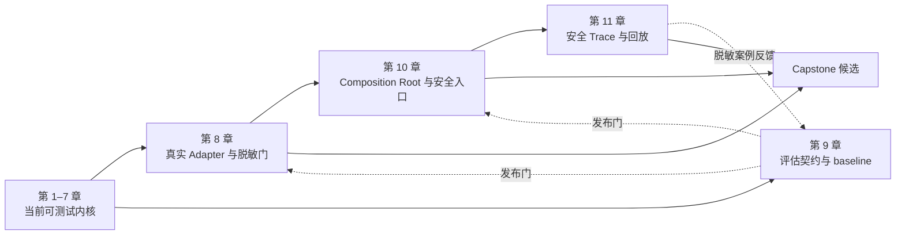

# Log Diagnosis Agent 教学文档

这里是本仓库教学文档的唯一入口。课程以当前 `src/log_agent` 和测试为事实源；文档中的“已完成”只表示仓库已有对应实现和测试，“设计完成”不等于真实外部系统已经接通。

## 先理解这是什么 Agent

它不是让模型自由执行 `Thought → Action → Observation` 的 ReAct loop，也不是每一步内容都预先写死的普通 workflow。

固定的是：

- 阶段和允许的状态转移；
- 查询权限、预算和终止条件；
- 证据账本与输出不变量；
- 模型、Splunk 和配置各自的信任边界。

动态的是：

- 模型提出的假设和验证目标；
- 实际查询返回的 Fact 与 Evidence；
- 在允许状态边内选择继续验证、换假设或收敛；
- 最终摘要和给人工的建议。

因此更准确的名称是 **workflow-controlled diagnostic agent**：程序拥有控制权，模型提供受约束的语义推理。

## 权威阅读顺序

| 章 | 文档 | 本章产物 | 当前状态 |
|---|---|---|---|
| 1 | [领域内核与状态机](01-领域内核与状态机.md) | 领域对象、Event/Command、状态不变量 | ✅ 已实现 |
| 2 | [端口与适配器](02-端口与适配器.md) | LogSearchPort、ReasoningPort、错误边界 | ✅ 已实现；真实 MCP 未提供 |
| 3 | [命令执行器与 Fake 闭环](03-命令执行器与Fake闭环.md) | CommandExecutor、Runner、Fake 纵向切片 | ✅ 已实现 |
| 4 | [安全查询管线](04-安全查询管线.md) | QueryPlan、ScopePolicy、Policy Gate | ✅ 本地非执行计划已实现 |
| 5 | [上下文与记忆设计](05-上下文与记忆设计.md) | WorkingMemory、引用账本、上下文与长期记忆边界 | 🟡 进程内已实现；持久化/长期记忆待实现 |
| 6 | [领域知识配置](06-领域知识配置.md) | 严格 JSON、KnowledgeSnapshot、权限隔离 | ✅ Schema/Loader 已实现 |
| 7 | [知识投影与结构化推理](07-知识投影与结构化推理.md) | KnowledgeProjection、模型草稿边界、证据别名 | ✅ provider-neutral + Fake 已实现 |
| 8 | [真实适配器与脱敏边界](08-真实适配器与脱敏边界.md) | Splunk/模型 wire contract、Redactor、契约测试门槛 | 🔴 文档设计；等待真实 MCP 与生产策略 |
| 9 | [评估与回归](09-评估与回归.md) | incident 数据契约、结果/过程指标、发布门槛 | 🟡 严格 Loader + deterministic Fake harness 已实现；历史质量评估待完成 |
| 10 | [Agent Loop 装配与安全入口](10-AgentLoop装配与安全入口.md) | Composition Root、入口授权、运行恢复边界 | 🟡 Runner 已有；生产入口/持久化待实现 |
| 11 | [可观测性与迭代](11-可观测性与迭代.md) | 安全 Trace、指标、回放、评估反馈闭环 | 🔴 文档设计；Trace sink 待实现 |

完成第 11 章后，再阅读 [Capstone：迁移与扩展](Capstone-迁移与扩展.md)。四阶段结构适用于诊断/调查类任务，不是所有 Agent 的固定模板。

## 第 8–11 章如何融入现有实现

教学阅读顺序是 8 → 9 → 10 → 11，但工程实施不是“写完一章再永远关闭它”：



- 第 8 章不改领域状态机，而是把现有 Port 映射到真实 wire contract。
- 第 9 章既评最终诊断，也把权限、预算、证据和泄漏测试设为第 8、10、11 章的发布门。
- 第 10 章复用现有 Runner；新增的是身份授权、装配、幂等、持久化和恢复边界。
- 第 11 章只记录安全控制事实，并把经过审批、脱敏的失败案例送回第 9 章，不直接改 Prompt 或知识。

第 9 章中不依赖生产数据的 deterministic eval harness 已完成第一版。接下来可以并行推进完整复现 manifest/baseline diff，并等待第 8 章所需的真实 MCP 与脱敏契约。

## 三种完成状态

- **已实现**：源码存在，并有单元或集成测试验证。
- **设计完成**：契约和验收门槛已写清，但还没有对应生产实现。
- **外部阻塞**：需要真实 MCP Schema、RBAC、生产数据分类、历史 incident 或模型 provider 决策，仓库不会虚构这些事实。

当前项目是“可测试架构 + Fake 完整闭环”，不是可连接生产日志的成品。真实日志在 Sanitizer/Redactor、字段分类、调用者授权和真实 Adapter 契约验收前禁止发送给外部模型。

## 配套资料

- [总体设计文档](日志诊断Agent-设计文档.md)：范围、架构和生产阻塞项。
- [开发教学路线](开发教学路线.md)：章节状态的紧凑视图。
- [课程大纲](课程大纲.md)：教学目标、主线和章节关系。
- [护栏、预算与终止复盘](专题-护栏预算与终止.md)：把护栏映射到当前状态机与查询安全实现；它是补充专题，不占用课程主线编号。
- `tests/unit`：每个边界的确定性契约测试。
- `tests/integration`：Fake 搜索和 Fake 模型的完整状态机闭环。

## 推荐学习方法

每一章都包含“代码导读”，统一给出源码文件、关键类/函数、执行链、建议阅读顺序和对应测试。尚未实现的章节会分别列出当前可用接缝与待实现边界，不把文档伪代码标成仓库源码。

每章按以下循环学习：

```text
先预测失败会发生在哪里
→ 阅读契约和取舍
→ 找到对应源码与测试
→ 故意破坏一条不变量
→ 运行定向测试并观察失败
→ 恢复实现并复盘边界
```

贯穿课程的示例统一为 `checkout-prod`：Checkout 出现 `PAYMENT_TIMEOUT`，Agent 提出 payment-service 超时假设，通过验证查询获得可引用证据，再由状态机决定 `COMPLETED` 或 `INCONCLUSIVE`。
